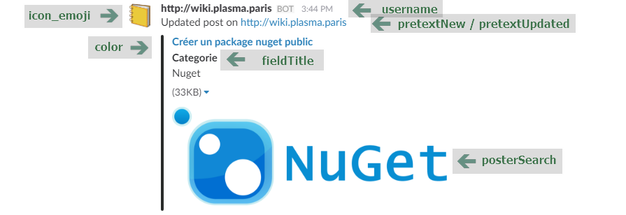

# hexo-slack-notify
A Hexo plugin to Slack nofify

## Installation

```sh
npm install Plasma-Paris/hexo-slack-notify --save
```

## Options

```yaml
slack:
  webhookUri: https://hooks.slack.com/services/[...]
  isSlackEnabled: true
  # pretextNew: Un nouveau post a été publié sur le wiki.
  # pretextUpdated: Une mise à  jours du post a été publié sur le wiki.
  # color: "#7CD197"
  # icon_emoji: ":orange_book:"
  # posterSearch: poster.png|illustration.jpg
  # username: TestUserName
  # fieldTitle:  TestCategorie
```




#### webhookUri

Webhook URL for Incoming WebHooks Slack

[https://api.slack.com/custom-integrations](https://api.slack.com/custom-integrations)

#### isSlackEnabled

Enable or disable Notifify.

#### pretextNew

Custom text when new post.

Default : `New post on`

#### pretextUpdated

Custom text when update post.

Default : `Updated post on`

#### color

Color for bar notification.

#### icon_emoji

Slack emoji.

#### posterSearch

Default : `illustration.png|illustration.jpg|poster.png|poster.jpg`

#### username

name of user post notify.

#### fieldTitle

Title for field